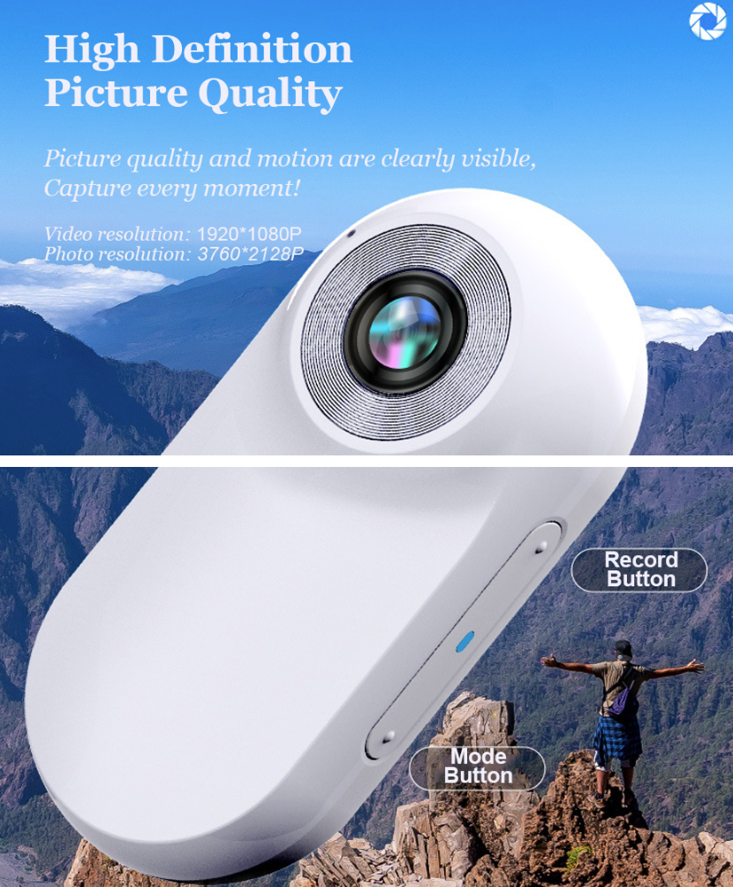
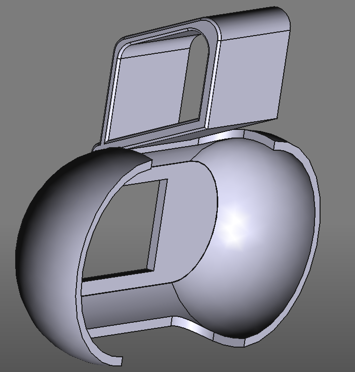

# FreeCad-CatCamHolder
## Introduction
Welcome to the Camera Holder for Cat project! 
This repository contains the project files for my very simple cam holder for a cheap china camera. Goes under many names.

The holder is designed to be 3d printed and i just created it with minimal effort and without being any good at using FreeCad, so please take it as it is and improve it.
I designed it to be easily attached to our cats normal collar.

All i wanted was for the camera to be better angled, the holder that came with the camera gave us long videos of grass seen from above.

FreeCAD Files Included: Modify the design to suit your specific needs using FreeCAD and please PR back.

## Installation
### Clone the Repository

bash
Copy code
git clone https://github.com/tobbelin/FreeCad-CatCamHolder.git
Open in FreeCAD

Download and install FreeCAD.
Open the .FCStd files in FreeCAD to view and edit the design.
### 3D Print the Parts

Export the parts as STL files from FreeCAD.
Use your preferred slicer software to prepare the files for 3D printing.
Print the parts using your 3D printer.

License
This project is free to use and modify as much as you want.
